#  Build and deploy an ASP.NET Core 2.2 Web API on Azure Kubernetes Service
This project describes the steps for building and deploying a real world **Medical Claims Processing** microservice application (**Claims API**) on Azure Kubernetes Service.

**Description:**

In a nutshell, you will work on the following tasks.
1. Deploy an **Azure SQL Server Database**.  Complete Section [A]. 
2. Provision a Linux VM (Bastion Host/Jump Box) on Azure and install pre-requisite software.  Complete Section [B].
3. Build and run the *Claims API* microservice locally on the Bastion Host.  Complete Section [C].
4. Deploy an **Azure DevOps** build container on the Bastion Host. Complete Section [D].
5. Deploy an **Azure Container Registry** (ACR). Complete Section [E].
6. Define a *Build Pipeline* in **Azure DevOps** (formerly Visual Studio Team Services).  Execute the build pipeline to build the ASP.NET Core application, containerize it and push the container image to the ACR.  This task focuses on the **Continuous Integration** aspect of the DevOps process.  Complete Section [F].
7.  Deploy an **Azure Kubernetes Service** (AKS) cluster.  Complete Section [G].
8.  Define a **Release Pipeline** in Azure DevOps and use **Helm** Kubernetes package manager to deploy the containerized microservice (Claims API) on AKS. This task focuses on the **Continuous Deployment** aspect of the DevOps process.  Complete Step [G].

This project demonstrates how to use Azure DevOps platform to build the application binaries, package the binaries within a container and deploy the container on Azure Kubernetes Service (AKS). The deployed microservice exposes a Web API (REST interface) and supports all CRUD operations for medical claims.  The microservice persists all claims records in a Azure SQL Server Database.

**Prerequisites:**
1.  An active **Microsoft Azure Subscription**.  You can obtain a free Azure subscription by accessing the [Microsoft Azure](https://azure.microsoft.com/en-us/?v=18.12) website.  In order to execute all the sections in this project, either your *Azure subscription* or the *Resource Group* **must** have **Owner** Role assigned to it.
2.  A **GitHub** Account to fork and clone this GitHub repository.
3.  A **Azure DevOps** (formerly Visual Studio Team Services) Account.  You can get a free Azure DevOps account by accessing the [Azure DevOps](https://azure.microsoft.com/en-us/services/devops/) web page.
4.  Review [Overview of Azure Cloud Shell](https://docs.microsoft.com/en-us/azure/cloud-shell/overview).  **Azure Cloud Shell** is an interactive, browser accessible shell for managing Azure resources.  You will be using the Cloud Shell to create the Bastion Host (Linux VM).
5.  **This project assumes readers are familiar with Linux containers (`eg., docker, OCI runc, Clear Containers ...`), Container Platforms (`eg., Kubernetes`), DevOps (`Continuous Integration/Continuous Deployment`) concepts and developing/deploying Microservices.  As such, this project is primarily targeted at technical/solution architects who have a good understanding of some or all of these solutions/technologies.  If you are new to Linux Containers/Kubernetes and/or would like to get familiar with container solutions available on Microsoft Azure, please go thru the hands-on labs that are part of the [MTC Container Bootcamp](https://github.com/Microsoft/MTC_ContainerCamp) first.**

**Workflow:**

For easy and quick reference, readers can refer to the following on-line resources as needed.
- [ASP.NET Core 2.2 Documentation](https://docs.microsoft.com/en-us/aspnet/core/?view=aspnetcore-2.2)
- [Docker Documentation](https://docs.docker.com/)
- [Kubernetes Documentation](https://kubernetes.io/docs/home/?path=users&persona=app-developer&level=foundational)
- [Creating an Azure VM](https://docs.microsoft.com/en-us/azure/virtual-machines/linux/quick-create-cli)
- [Azure Kubernetes Service (AKS) Documentation](https://docs.microsoft.com/en-us/azure/aks/)
- [Azure Container Registry Documentation](https://docs.microsoft.com/en-us/azure/container-registry/)
- [Azure DevOps Documentation](https://docs.microsoft.com/en-us/vsts/index?view=vsts)
- [Install Azure CLI 2.0](https://docs.microsoft.com/en-us/cli/azure/install-azure-cli?view=azure-cli-latest)

**Steps:**

**Important Notes:**
- AKS is a managed [Kubernetes](https://kubernetes.io/) service on Azure.  Please refer to the [AKS](https://azure.microsoft.com/en-us/services/container-service/) product web page for more details.
- This project has been tested on AKS v1.11.4+.
- Commands which are required to be issued on a Linux terminal window are prefixed with a `$` sign.  Lines that are prefixed with the `#` symbol are to be treated as comments.
- This project requires **all** resources to be deployed to the same Azure **Resource Group**.
- Specify either **eastus**, **westus**, **westus2** or **centralus** as the *location* for the Azure *Resource Group* and the *AKS cluster*.

## A] Deploy an Azure SQL Server and Database
**Approx. time to complete this section: 20 minutes**

In this section, we will create an Azure SQL Server instance and create a database (`ClaimsDB`).  This database will be used by the Claims API microservice to persist *Claims* records.

1.  Login to the [Azure Portal](https://portal.azure.com) using your credentials and use a [Azure Cloud Shell](https://shell.azure.com) session to perform the next steps.  Azure Cloud Shell is an interactive, browser-accessible shell for managing Azure resources.  The first time you access the Cloud Shell, you will be prompted to create a resource group, storage account and file share.  You can use the defaults or click on *Advanced Settings* to customize the defaults.  Accessing the Cloud Shell is described in [Overview of Azure Cloud Shell](https://docs.microsoft.com/en-us/azure/cloud-shell/overview). 

2.  An Azure resource group is a logical container into which Azure resources are deployed and managed.  From the Cloud Shell, use Azure CLI to create a **Resource Group**.  Azure CLI is already pre-installed and configured to use your Azure account (subscription) in the Cloud Shell.  Alternatively, you can also use Azure Portal to create this resource group.  
    ```
    az group create --name myResourceGroup --location westus2
    ```
    **NOTE:** Keep in mind, if you specify a different name for the resource group (other than **myResourceGroup**), you will need to substitute the same value in multiple CLI commands in the remainder of this project!  If you are new to Azure Cloud, it's best to use the suggested name.

3.  In the Azure Portal, click on **Create a resource**, **Databases** and then click on **SQL Database** as shown in the screenshot below.  

    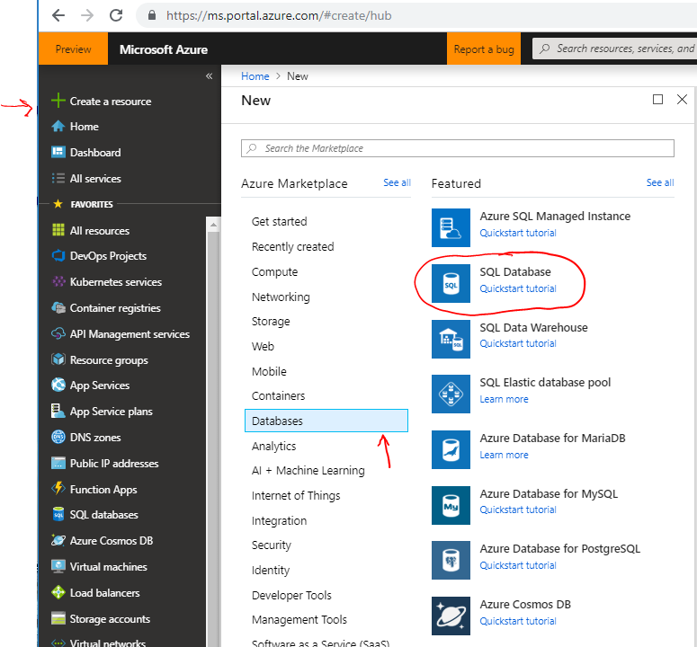
    
    In the **SQL Database** tab, provide a name for the database (`ClaimsDB`), select the resource group which you created in the previous step and leave the default value (Blank database) for **Select source** field as-is.  Click on **Server** and fill in the details in the **New Server** tab.  The **Server name** value should be unique as the SQL database server FQDN will be constructed with this name eg., <SQL_server_name>.database.windows.net. Use a pattern such as **<Your_Initial>sqldb** for the server name (Replace *Your_Initial* with your initials).  For the **location** field, use the same location which you specified for the resource group.  Click **Select** in the **New Server** tab.  See screenshot below.

    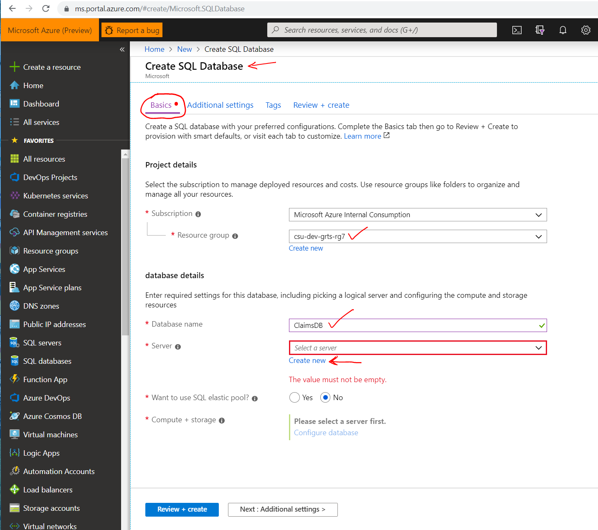

    In the **SQL Database** tab, select a **Pricing tier**, leave the **Collation** field as-is and then click on **Create**.

    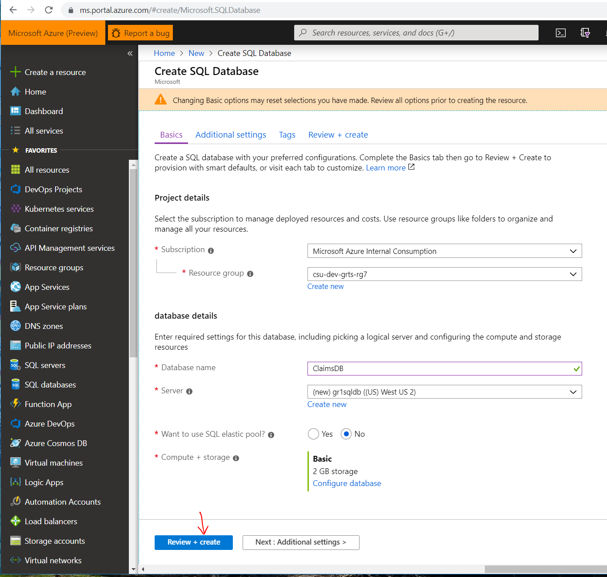

    It will take approx. 10 minutes for the SQL Server instance and database to get created.

4.  Once the SQL Server provisioning process is complete, click on the database `ClaimsDB`. In the **Overview** tab, click on **Set server firewall** as shown in the screenshot below.

    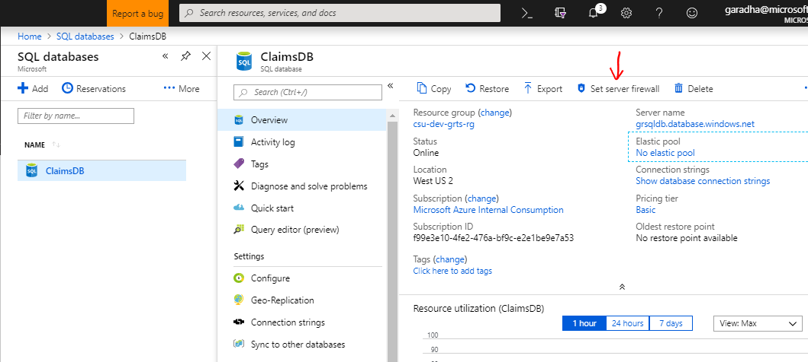

    In the **Firewall settings** tab, configure a *rule* to allow inbound connections from all public IP addresses as shown in the screenshots below.  Alternatively, if you know the Public IP address of your workstation/pc, you can create a rule to only allow inbound connections from your local pc.  Leave the setting for **Allow access to Azure services** ON.  See screenshot below.

    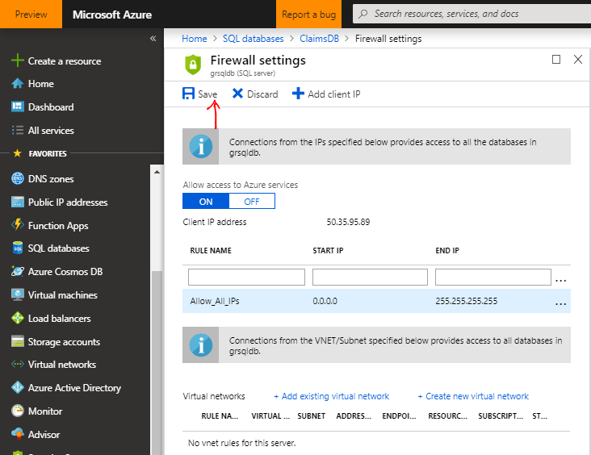

    Click on **Save**.

    **NOTE**: Remember to delete the firewall rule setting once you are done working on this hands-on lab.  

5.  In the **ClaimsDB** tab, click on **Connection strings** in the left navigational panel (blade).  Copy the SQL Server database connection string under the **ADO.NET** tab and save the value in a file.  We will need this connection string in the next section to configure the SQL Server database for the Claims API microservice.  See screenshot below.

    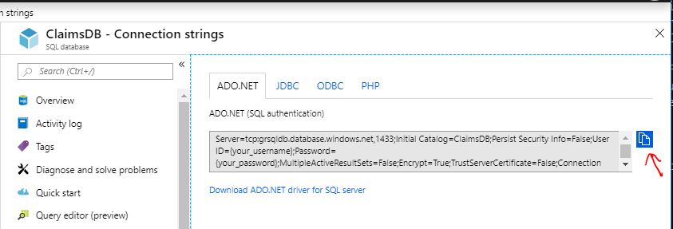

### B] Provision a Linux CentOS VM on Azure (~ Bastion Host) and install pre-requisite software
**Approx. time to complete this section: 1 Hour**

The following tools (binaries) will be installed on the Linux VM.

- Azure DevOps (VSTS) build agent (docker container). The build container will be used for running application and container builds.
- Azure CLI 2.0 client.  Azure CLI will be used to administer and manage all Azure resources including the AKS cluster resources.
- Git client.  The Git client will be used to clone this GitHub repository and then push source code changes to the forked repository.
- .NET Core SDK.  This SDK will be used to build and test the microservice application locally. 
- Kubernetes CLI (`kubectl`).  This CLI will be used for managing and introspecting the current state of resources deployed on the Kubernetes (AKS) cluster.
- Helm CLI (`helm`).  Helm is a package manager for Kubernetes and will be used to manage and monitor the lifecyle of application deployments on AKS.
- Docker engine and client.  Docker engine will be used to run the Azure DevOps build agent. It will also be used to build and run the Claims API microservice container locally. 

Follow the steps below to create the Bastion host (Linux VM), install pre-requisite software  on this VM and run the Azure DevOps build agent.

1.  Fork this [GitHub repository](https://github.com/ganrad/aks-aspnet-sqldb-rest) to **your** GitHub account.  In the browser window, click on **Fork** in the upper right hand corner to get a separate copy of this project added to your GitHub account.  You must be signed in to your GitHub account in order to fork this repository.

    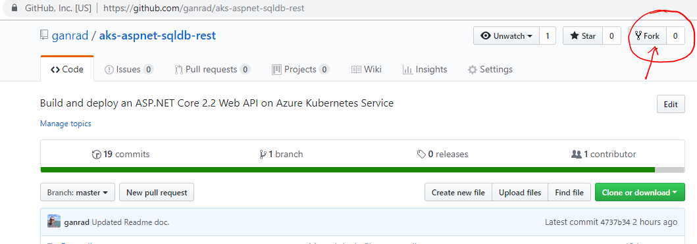

2.  Open the [Azure Cloud Shell](https://shell.azure.com) in a separate browser tab and use the command below to create a **CentOS 7.4** VM on Azure.  Make sure you specify the correct **resource group** name and provide a value for the *password*.  Once the command completes, it will print the VM connection info. in the JSON message (response).  Save the **Public IP address**, **Login name** and **Password** info. in a file.  Alternatively, if you prefer you can use SSH based authentication to connect to the Linux VM.  The steps for creating and using an SSH key pair for Linux VMs in Azure is described [here](https://docs.microsoft.com/en-us/azure/virtual-machines/linux/mac-create-ssh-keys).  You can then specify the location of the public key with the `--ssh-key-path` option to the `az vm create ...` command.
    ```
    az vm create --resource-group myResourceGroup --name k8s-lab --image OpenLogic:CentOS:7.4:7.4.20180118 --size Standard_B2s --generate-ssh-keys --admin-username labuser --admin-password <password> --authentication-type password
    ```

3.  Login into the Linux VM via SSH.  On a Windows PC, you can use a SSH client such as [Putty](https://putty.org/) or the Windows Sub-System for Linux (Windows 10) to login into the VM.

    **NOTE:** Use of Cloud Shell to SSH into the VM is **NOT** recommended.
    ```
    # SSH into the VM.  Substitute the public IP address for the Linux VM in the command below.
    $ ssh labuser@x.x.x.x
    #
    ```

4.  Install Git client and clone [this repository](https://github.com/ganrad/aks-aspnet-sqldb-rest).  When cloning the repository, make sure to use your Account ID in the GitHub URL.
    ```
    # Switch to home directory
    $ cd
    #
    # Install Git client
    $ sudo yum install -y git
    #
    # Check Git version number
    $ git --version
    #
    # Create a new directory for GitHub repositories.
    $ mkdir git-repos
    #
    # Change the working directory to 'git-repos'
    $ cd git-repos
    #
    # Clone your GitHub repository into directory 'git-repos'.  Cloning this repo. will allow you to make changes to the application artifacts in the forked GitHub project.
    # Substitute your GitHub Account ID in the URL.
    $ git clone https://github.com/<YOUR-GITHUB-ACCOUNT>/aks-aspnet-sqldb-rest.git
    #
    # Switch to home directory
    $ cd
    ```

5.  Install Azure CLI and login into your Azure account.
    ```
    # Install Azure CLI on this VM.
    #
    # Import the Microsoft repository key.
    $ sudo rpm --import https://packages.microsoft.com/keys/microsoft.asc
    #
    # Create the local azure-cli repository information.
    $ sudo sh -c 'echo -e "[azure-cli]\nname=Azure CLI\nbaseurl=https://packages.microsoft.com/yumrepos/azure-cli\nenabled=1\ngpgcheck=1\ngpgkey=https://packages.microsoft.com/keys/microsoft.asc" > /etc/yum.repos.d/azure-cli.repo'
    #
    # Install with the yum install command.
    $ sudo yum install -y azure-cli
    #
    # Check the Azure CLI version (Should be 2.0.54+)
    $ az -v
    #
    # Login to your Azure account.  Use your Azure login ID and password to login.
    $ az login -u <user name> -p <password>
    #
    ```

6.  Install K8s CLI, Helm CLI and .NET Core SDK on this VM.
    ```
    # Make sure you are in the home directory
    $ cd
    #
    # Install Helm v2.9.1
    # Create a new directory 'Helm' under home directory to store the helm binary
    $ mkdir helm
    $ cd helm
    $ wget https://storage.googleapis.com/kubernetes-helm/helm-v2.9.1-linux-amd64.tar.gz
    $ tar -xzvf helm-v2.9.1-linux-amd64.tar.gz
    #
    # Switch back to home directory
    $ cd
    #
    # Install Kubernetes CLI
    # Create a new directory 'aztools' under home directory to store the kubectl binary
    $ mkdir aztools
    #
    # Install kubectl binary in the new directory
    $ az aks install-cli --install-location=./aztools/kubectl
    #
    # Register the Microsoft key, product repository and required dependencies.
    $ sudo rpm -Uvh https://packages.microsoft.com/config/rhel/7/packages-microsoft-prod.rpm
    #
    # Update the system libraries.  This command will take a few minutes (~10 mins) to complete.  Be patient!
    $ sudo yum update
    #
    # Install .NET Core 2.2 binaries
    $ sudo yum install -y dotnet-sdk-2.2
    #
    # Check .NET Core version (Should print 2.2.100)
    $ dotnet --version
    #
    # Finally, update '.bashrc' file and set the path to Helm and Kubectl binaries
    $ KUBECLI=/home/labuser/aztools
    $ HELM=/home/labuser/helm/linux-amd64
    $ echo "export PATH=$KUBECLI:$HELM:${PATH}" >> ~/.bashrc
    #
    ```

7.  Next, install **docker-ce** container runtime. Refer to the commands below.  You can also refer to the [Docker CE install docs for CentOS](https://docs.docker.com/install/linux/docker-ce/centos/).
    ```
    $ sudo yum install -y yum-utils device-mapper-persistent-data lvm2
    $ sudo yum-config-manager --add-repo https://download.docker.com/linux/centos/docker-ce.repo
    $ sudo yum install -y docker-ce-18.03.0.ce
    $ sudo systemctl enable docker
    $ sudo groupadd docker
    $ sudo usermod -aG docker labuser
    ```

    LOGOUT AND RESTART YOUR LINUX VM BEFORE PROCEEDING.  You can restart the VM via Azure Portal.  Alternatively, use the command below to reboot the VM.
    ```
    $ sudo shutdown -r now
    #
    ```

    Once the Linux VM is back up, log back in to the VM via SSH.  Run the command below to verify **docker** engine is running.
    ```
    $ docker info
    ```

### C] Build and run the Claims API microservice locally on the Linux VM
**Approx. time to complete this section: 45 minutes**

In this section, we will work on the following tasks
- Configure the Azure SQL Server connection string in the Claims API microservice (source code)
- Build the Claims API microservice using the .NET Core 2.2 SDK
- Run the .NET Core *Entity Framework* migrations to create the relational database tables in Azure SQL Server provisioned in Section [A].  These tables will be used to persist Claims records.
- Run the Claims API microservice locally using the .NET Core 2.2 SDK
- Build the microservice Docker container and run the container

Before proceeding, login into the Linux VM using SSH.

1.  Update the Azure SQL Server database connection string value in the **appsettings.json** file.

    The attribute **SqlServerDb** holds the database connection string and should point to the Azure SQL Server database instance which we provisioned in Section [A].  You should have saved the SQL Server connection string value in a file.

    Refer to the comands below to edit the SQL Server database *Connection string*...
    ```
    # Switch to the source code directory.  This is the directory where you cloned this GitHub repository.
    $ cd git-repos/aks-aspnet-sqldb-rest
    #
    ```
    
    Edit the `appsettings.json` file using **vi** or **nano** editor and configure the SQL Server connection string value.  Replace the variable tokens and specify correct values for **SQL_SRV_PREFIX**, **SQL_USER_ID** and **SQL_USER_PWD** in the connection string.  Do not include the curly braces and the hash symbols (#{ xxx }#) when specifying the values.  See the screenshot below.

    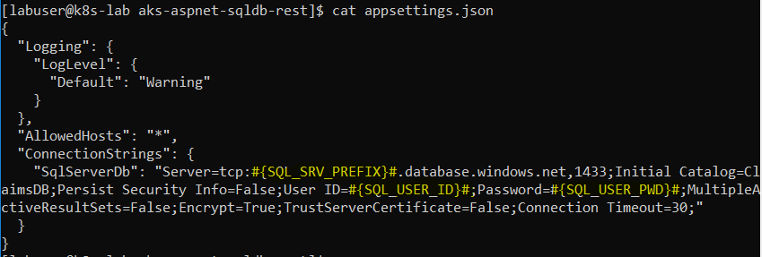

2.  Build the Claims API microservice using the .NET Core SDK.

    ```
    #
    # Build the Claims API microservice
    $ dotnet build
    #
    ```

3.  Create and run the database migration scripts. 
  
    This step will create the database tables for persisting *Claims* records in the Azure SQL Server database.  Refer to the command snippet below.
    ```
    # Run the .NET Core CLI command to create the database migration scripts
    $ dotnet ef migrations add InitialCreate
    #
    # Run the ef (Entity Framework) migrations
    $ dotnet ef database update
    #
    ```

    Login to the Azure Portal and check if the database tables have been created. See screenshot below.

    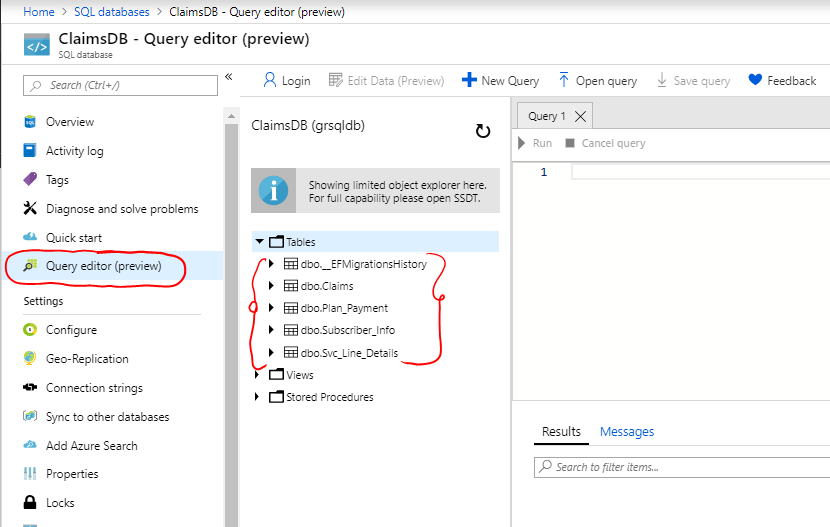

4.  Run the Claims API locally using the .NET Core SDK.

    Run the Claims API microservice in a Linux terminal window.  Refer to the commands below.
    ```
    # Make sure you are in the Claims API source code directory
    $ pwd
    /home/labuser/git-repos/aks-aspnet-sqldb-rest
    #
    # Run the microservice
    $ dotnet run
    #
    ```

    Login to the Linux VM using another SSH terminal session.  Use the **Curl** command to invoke the Claims API end-point.  Refer to the command snippet below.
    ```
    # Use curl command to hit the claims api end-point.  
    $ curl -i http://localhost:5000/api/claims
    #
    ```

    The API end-point should return a 200 OK HTTP status code and also return one claim record in the HTTP response body.  See screenshot below.

    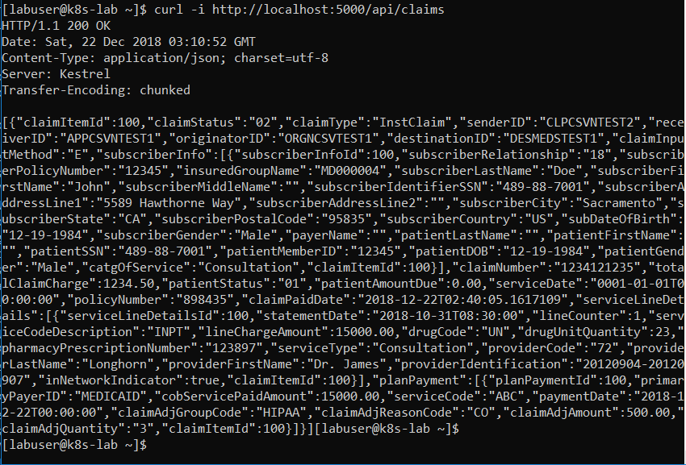

5.  Build and run the Claims API with Docker for Linux containers.

    In the SSH terminal window where you started the application (dotnet run), press Control-C to exit out of the command.  Follow the instructions in the command snippet below.
    ```
    # Make sure you are in the Claims API source code directory
    $ pwd
    /home/labuser/git-repos/aks-aspnet-sqldb-rest
    #
    # Run the docker build.  The build will take a few minutes to download both the .NET core build and run-time containers!
    $ docker build -t claims-api .
    #
    # List the docker images on this VM.  You should see two container images ('2.2-sdk' and '2.2-aspnetcore-runtime') in the 'microsoft/dotnet' repository.
    # Compare the sizes of the two dotnet container images and you will notice the size of the runtime image is pretty small ~ 260MB.
    $ docker images
    #
    # Run the application container
    $ docker run -it --rm -p 5000:80 --name test-claims-api claims-api
    #
    ```

    Switch to the other SSH terminal window and invoke the Claims API HTTP end-point again using **Curl** command.  You should get the same HTTP response output as in the previous step.

You have now tested the Claims API microservice locally on this VM.  Press Control-C to exit out of the command (docker run ...) and get back to the terminal prompt.

### D] Deploy the Azure DevOps (VSTS) build container
**Approx. time to complete this section: 30 minutes**

If you haven't already, login to the Linux VM using a SSH terminal session.

1.  Pull the Azure DevOps (VSTS) build agent container from docker hub.

    It will take approx. 20 minutes to download the image (Size ~ 10+ GB).  Take a coffee break.
    ```
    $ docker pull microsoft/vsts-agent
    $ docker images
    ```

2.  Generate a Azure DevOps (VSTS) personal access token (PAT).

    The PAT token will be used to connect the Azure DevOps build agent to your Azure DevOps account.

    Login to [Azure DevOps](https://dev.azure.com) using your account ID. In the upper right, click on your profile image and click **Security**.  

    

    Click on **New Token** to create a new PAT.  See screenshot below.

    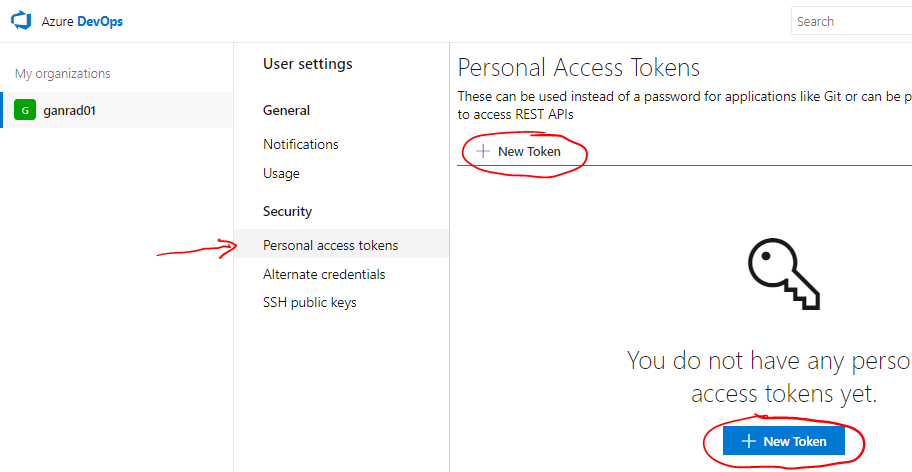

    In the **Create a new personal access token** tab, provide a **Name** for the token, check the radio button besides **Full access**, select an **Expiration** period and click **Create**.  See screenshot below.

    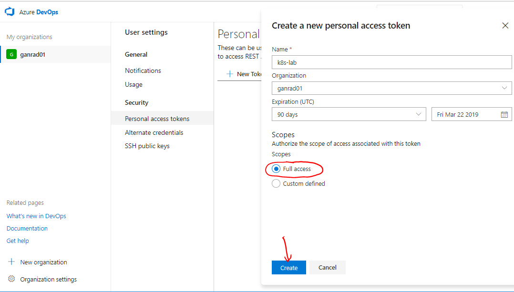

    In the next page, make sure to **copy and store** the PAT (token) into a file.  Keep in mind, you will not be able to retrieve this token again.  Incase you happen to lose or misplace the token, you will need to generate a new PAT and use it to reconfigure the VSTS build agent.  So save this PAT (token) to a file.

3.  Start the Azure DevOps (VSTS) build container.

    The *Continuous Integration* (CI) and *Continuous Deployment* (CD) pipelines deployed on Azure DevOps will be executed by the build container on the Linux VM.

    Refer to the table below to set the parameter values for the build container correctly.

    Parameter | Value
    --------- | -----
    VSTS_TOKEN | VSTS PAT Token.  This is the value which you copied and saved in a file in the previous step.
    VSTS_ACCOUNT | VSTS Organization name.  An Org. is a container for DevOps projects in Azure DevOps (VSTS) platform.  It's usually the first part (Prefix) of the VSTS URL (eg., **Prefix**.visualstudio.com).  If you are using Azure DevOps URL, then it is the last part (ContextPath) of the URL (eg., dev.azure.com/**ContextPath**).
    VSTS_POOL | VSTS Agent Pool Name.  For this lab, use value **'Default'**.  **NOTE:**In case you use a different name for the pool, you will need to first create this pool in your VSTS account.  Otherwise the agent will not be able to connect to the pool.

    In the Linux terminal window, start the Azure DevOps (VSTS) build container.  See command snippet below.
    ```
    # Substitute the correct values for VSTS_ACCOUNT, VSTS_POOL and VSTS_TOKEN before running this command
    #
    $ docker run -e VSTS_ACCOUNT=<Org. Name> -e VSTS_TOKEN=<PAT Token> VSTS_POOL=Default -v /var/run/docker.sock:/var/run/docker.sock --name vstsagent --rm -it microsoft/vsts-agent
    #
    ```

    The VSTS build agent will initialize and you should see a message indicating "Listening for Jobs".  See below.  
    ```
    Determining matching VSTS agent...
    Downloading and installing VSTS agent...

    >> End User License Agreements:

    Building sources from a TFVC repository requires accepting the Team Explorer Everywhere End User License Agreement. This step is not required for building sources from Git repositories.

    A copy of the Team Explorer Everywhere license agreement can be found at:
      /vsts/agent/externals/tee/license.html


    >> Connect:

    Connecting to server ...

    >> Register Agent:

    Scanning for tool capabilities.
    Connecting to the server.
    Successfully added the agent
    Testing agent connection.
    2018-12-23 05:26:36Z: Settings Saved.
    Scanning for tool capabilities.
    Connecting to the server.
    2018-12-23 05:26:39Z: Listening for Jobs
    ```

    Minimize this terminal window for now as you will only be using it to view the results of a Azure DevOps build.  Before proceeding, open another terminal (WSL Ubuntu/Putty) window and login (SSH) into the Linux VM.

### E] Deploy Azure Container Registry (ACR)
**Approx. time to complete this section: 10 minutes**

In this step, we will deploy an instance of Azure Container Registry to store container images which we will build in later steps.  A container registry such as ACR allows us to store multiple versions of application container images in one centralized repository and consume them from multiple nodes (VMs/Servers) where our applications are deployed.

1.  Login to your Azure portal account.  Then click on **Container registries** in the navigational panel on the left.  If you don't see this option in the nav. panel then click on **All services**, scroll down to the **COMPUTE** section and click on the star beside **Container registries**.  This will add the **Container registries** option to the service list in the navigational panel.  Now click on the **Container registries** option.  You will see a page as displayed below.

    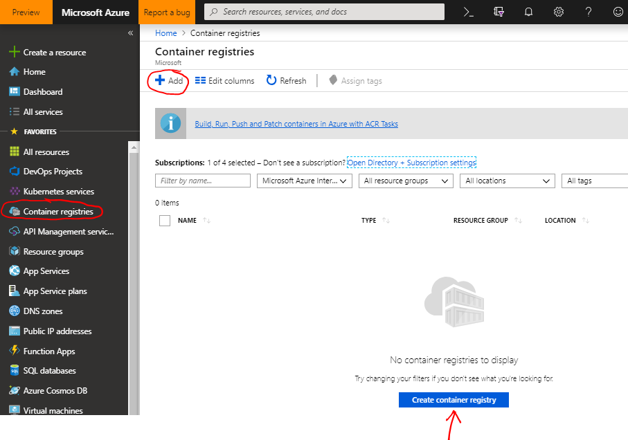

2.  Click on **Add** to create a new ACR instance.  Give a meaningful name to your registry and make a note of it.  Select an Azure **Subscription**, select the **Resource group** which you created in Section [A] and leave the **Location** field as-is.  The location should default to the location assigned to the resource group.  Select the **Basic** pricing tier.  Click **Create** when you are done.

    

### F] Define and execute a Build pipeline in Azure DevOps for containerizing the Claims API microservice
**Approx. time to complete this section: 1 Hour**

In this step, we will create a **Continuous Integration** (CI) pipeline in Azure DevOps.  This pipeline will contain the tasks for building the microservice (binary artifacts) and packaging (layering) it within a docker container.  During the application container build process, the application binary is layered on top of a base docker image (microsoft/dotnet).  Finally, the built application container is pushed into ACR which you deployed in Step [E].

Before proceeding with the next steps, feel free to go thru the **dockerfile** and Claims API source files in the GitHub repository.  This will help you understand how the container is built when the continuous integration (CI) pipeline is executed in Azure DevOps.

1.  Enable *Preview* features in Azure DevOps.

    If you haven't already done so, login to [VSTS](https://www.visualstudio.com/team-services/) using your Microsoft Live ID (or Azure AD ID).  Click on your profile picture (top right corner) and then click on **Preview Features**.  Ensure the check box for feature **New YAML pipeline creation experience** is disabled.  See screenshots below.

    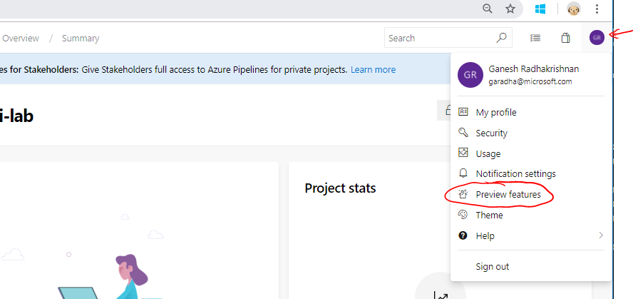

    

2.  Create an Azure DevOps *Organization* and *Project*.

    Give the Organization a meaningful name (eg., claims-api-lab) and then create a new *DevOps Project*. Give a name to your project.  See screenshots below.

    

    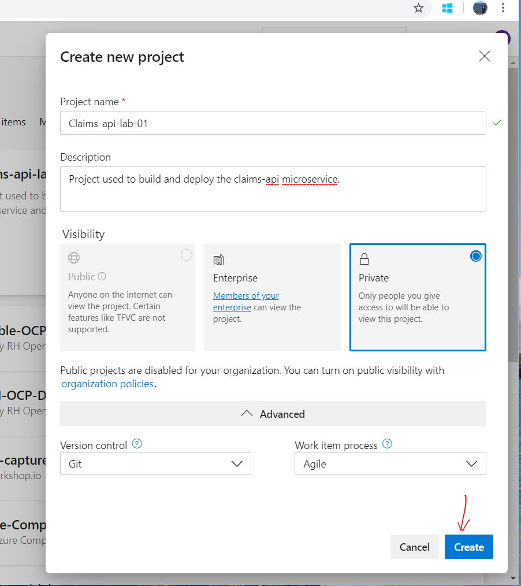

3.  Create a **Build** definition and define tasks which will execute as part of the application build process.

    Click on **Pipelines** in the left navigational menu and then select *Builds*.  Then click on **New pipeline**.

    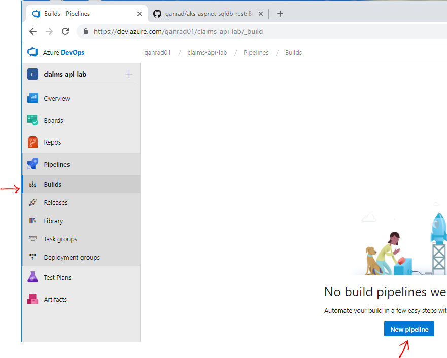

    In the **Select a source** page, select *GitHub* as the source repository. Give your connection a *name* and then select *Authorize using OAuth* link.  Optionally, you can use a GitHub *personal access token* instead of OAuth.  When prompted, sign in to your **GitHub account**.  Then select *Authorize* to grant access to your Azure DevOps account.

    Once authorized, select the **GitHub Repo** which you forked in Step [B] above.  Make sure you replace the account name in the **GitHub URL** with your account name.  Then hit continue.

    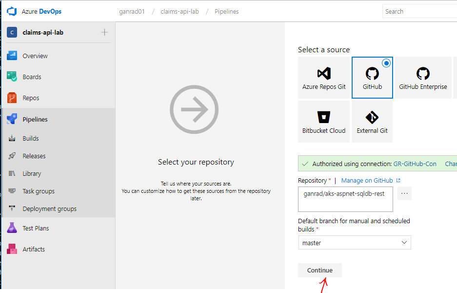

    Search for text *Docker* in the **Select a template** field and then select *Docker container* task.  Then click apply.

    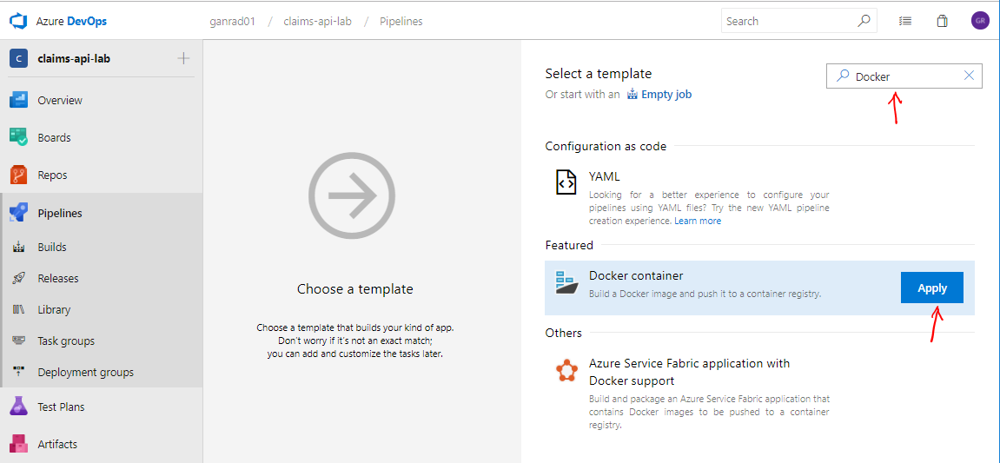

    Select *Default* in the **Agent Queue** field.  The VSTS build agent which you deployed in Step [D] connects to this *queue* and listens for build requests.

    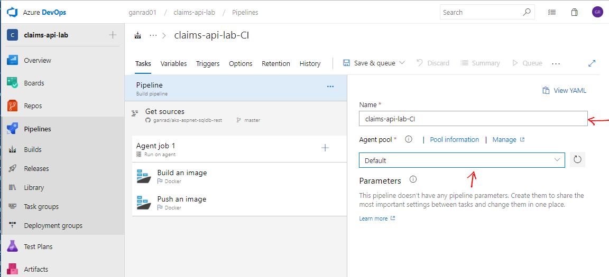

    On the top extensions menu in Azure DevOps, click on **Browse Markplace** (Bag icon).  Save your build pipeline before proceeding.  Then search for text **replace tokens**.  In the results list below, click on **Replace Tokens** (By Guillaume Rouchon).  Then click on **Get it free** to install this extension in your Azure DevOps account.

    

    Edit your DevOps build definition and click on the **Variables** tab as shown in the screenshot below.

    

    Define 3 variables **SQL_SRV_PREFIX**, **SQL_USER_ID** and **SQL_USER_PWD**.  These variables should specify database connection string values for Azure SQL Server instance which you provisioned in Step [A] above.  Click on **+ Add** to add a new variable and specify the correct value for each variable as shown in the screenshot below.  

    

    Switch back to the **Tasks** tab and click on the plus symbol beside **Agent job 1**.  Search by text **replace tokens** and then select the extension **Replace Tokens** which you just installed in the previous step.  Click **Add**.  See screenshot below.

    

    Move the **Replace tokens** task to the top of the task list (click and drag the task).  Then update values of fields **Display name** and **Target files** as shown in the screenshot below.

    

    Next, we will package the application binary within a container image.  Review the **dockerfile** in the source repository to understand how the application container image is built.

    Click on the **Build an image** task on the left panel.  Specify *Build container image* for **Display name** field and *Azure Container Registry* for **Container Registry Type**.  In the **Azure Subscription** field, select your Azure subscription.  Click on **Authorize**.  In the **Azure Container Registry** field, select the ACR which you provisioned in Step [E] above.  Check to make sure the **Docker File** field is set to `dockerfile`.  For **Image Name** field, specify value *claims-api:$(Build.BuildId)* and enable **Qualify Image Name** checkbox.  In the **Action** field, select *Build an image*.  Also enable **Include Latest Tag** checkbox.  See screenshot below.

    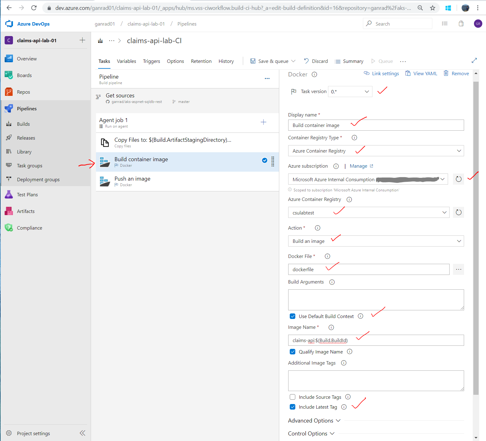

    Once the application container image has been built, we will push it into the ACR.

    Click on the *Push an image* task on the left panel.  Specify *Push container image to ACR* for field **Display name** and *Azure Container Registry* for **Container Registry Type**.  In the **Azure Subscription** field, select your Azure subscription (Under Available Azure service connections).  In the **Azure Container Registry** field, select the ACR which you provisioned in Step [E] above.  For **Image Name** field, specify value *claims-api:$(Build.BuildId)* and enable **Qualify Image Name** checkbox.  In the **Action** field, select *Push an image*.  Also enable **Include Latest Tag** checkbox.  See screenshot below.

    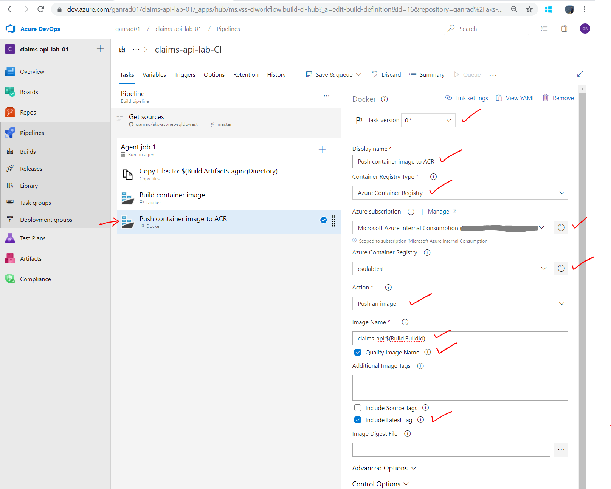

4.  Run the application container build.

    At the top of the page, click **Save and Queue** to save the build definition and queue it for execution. Click on the **Build number** on the top of the page to view the progress of the build.  Wait for the build process to finish.  When all build tasks complete OK and the build process finishes, you will see the screen below.

    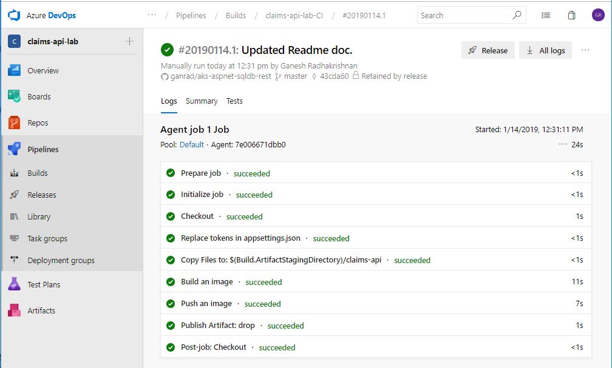

    Switch to the VSTS build agent terminal window and you will notice that a build request was received from VSTS and processed successfully. See below.

    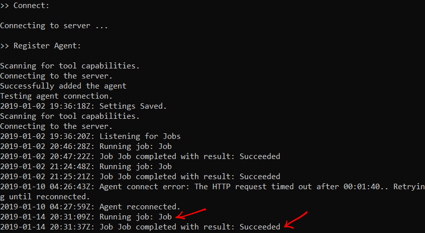

    Login to the Azure portal, open the blade for *Azure Container Registry* and verify that the container for Claims API microservice (`claims-api:latest`) has been pushed into the registry.

    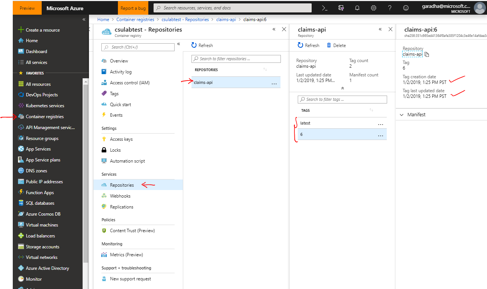

You have now successfully built the Claims API microservice container image and pushed it to the Azure Container Registry.

### G] Create an Azure Kubernetes Service (AKS) cluster and deploy Springboot microservice
**Approx. time to complete this section: 1 - 1.5 Hours**

In this step, we will first deploy an AKS cluster on Azure.  The Springboot **Purchase Order** microservice application reads/writes purchase order data from/to a relational (MySQL) database.  So we will deploy a **MySQL** database container (ephemeral) first and then deploy our Springboot Java application.  Kubernetes resources (object definitions) are usually specified in manifest files (yaml/json) and then submitted to the API Server.  The API server is responsible for instantiating corresponding objects and bringing the state of the system to the desired state.

Kubernetes manifest files for deploying the **MySQL** and **po-service** (Springboot application) containers are provided in the **k8s-scripts/** folder in this GitHub repository.  There are two manifest files in this folder **mysql-deploy.yaml** and **app-deploy.yaml**.  As the names suggest, the *mysql-deploy* manifest file is used to deploy the **MySQL** database container and the other file is used to deploy the **Springboot** microservice respectively.

Before proceeding with the next steps, feel free to inspect the Kubernetes manifest files to get a better understanding of the following.  These are all out-of-box capabilities provided by Kubernetes.
-  How confidential data such as database user names & passwords are injected (at runtime) into the application container using **Secrets**
-  How application configuration information (non-confidential) such as database connection URL and the database name parameters are injected (at runtime) into the application container using **ConfigMaps**
-  How **environment variables** such as the MySQL listening port is injected (at runtime) into the application container.
-  How services in Kubernetes can auto discover themselves using the built-in **Kube-DNS** proxy.

In case you want to modify the default values used for MySQL database name and/or database connection properties (user name, password ...), refer to [Appendix A](#appendix-a) for details.  You will need to update the Kubernetes manifest files.

Follow the steps below to provision the AKS cluster and deploy the *po-service* microservice.
1.  Ensure the *Resource provider* for AKS service is enabled (registered) for your subscription.  A quick and easy way to verify this is, use the Azure portal and go to *->Azure Portal->Subscriptions->Your Subscription->Resource providers->Microsoft.ContainerService->(Ensure registered)*.  Alternatively, you can use Azure CLI to register all required service providers.  See below.
    ```
    az provider register -n Microsoft.Network
    az provider register -n Microsoft.Storage
    az provider register -n Microsoft.Compute
    az provider register -n Microsoft.ContainerService
    ```

2.  At this point, you can use a) The Azure Portal Web UI to create an AKS cluster and b) The Kubernetes Dashboard UI to deploy the Springboot Microservice application artifacts.  To use a web browser (*Web UI*) for deploying the AKS cluster and application artifacts, refer to the steps in [extensions/k8s-dash-deploy](./extensions/k8s-dash-deploy).

    **NOTE**: If you are new to Kubernetes and not comfortable with issuing commands on a Linux terminal window, use the Azure Portal and the Kubernetes dashboard UI (link above).

    Alternatively, if you prefer CLI for deploying and managing resources on Azure and Kubernetes, continue with the next steps.

    (If you haven't already) Open a terminal window and login to the Linux VM (Bastion host).
    ```
    #
    # Check if kubectl is installed OK
    $ kubectl version -o yaml
    ```

3.  Refer to the commands below to create an AKS cluster.  If you haven't already created a **resource group**, you will need to create one first.  If needed, go back to step [A] and review the steps for the same.  Cluster creation will take a few minutes to complete.
    ```
    # Create a 1 Node AKS cluster
    $ az aks create --resource-group myResourceGroup --name akscluster --node-count 1 --dns-name-prefix akslab --generate-ssh-keys --disable-rbac  --kubernetes-version "1.11.4"
    #
    # Verify state of AKS cluster
    $ az aks show -g myResourceGroup -n akscluster --output table
    ```

4.  Connect to the AKS cluster and initialize **Helm** package manager.
    ```
    # Configure kubectl to connect to the AKS cluster
    $ az aks get-credentials --resource-group myResourceGroup --name akscluster
    #
    # Check cluster nodes
    $ kubectl get nodes -o wide
    #
    # Check default namespaces in the cluster
    $ kubectl get namespaces
    #
    # Initialize Helm.  This will install 'Tiller' on AKS.  Wait for this command to complete!
    $ helm init
    #
    # Check if Helm client is able to connect to Tiller on AKS.
    # This command should list both client and server versions.
    $ helm version
    ```

5.  Next, create a new Kubernetes **namespace** resource.  This namespace will be called *development*.  
    ```
    # Make sure you are in the *k8s-springboot-data-rest* directory.
    $ kubectl create -f k8s-scripts/dev-namespace.json 
    #
    # List the namespaces
    $ kubectl get namespaces
    ```

6.  Create a new Kubernetes context and associate it with the **development** namespace.  We will be deploying all our application artifacts into this namespace in subsequent steps.
    ```
    # Create the 'dev' context
    $ kubectl config set-context dev --cluster=akscluster --user=clusterUser_myResourceGroup_akscluster --namespace=development
    #
    # Switch the current context to 'dev'
    $ kubectl config use-context dev
    #
    # Check your current context (should list 'dev' in the output)
    $ kubectl config current-context
    ```

7.  Configure Kubernetes to pull application container images from ACR (configured in step [B]).  When AKS cluster is created, Azure also creates a 'Service Principal' (SP) to support cluster operability with other Azure resources.  This auto-generated service principal can be used to authenticate against the ACR.  To do so, we need to create an Azure AD role assignment that grants the cluster's SP access to the Azure Container Registry.  In a Linux terminal window, update the shell script `shell-scripts/acr-auth.sh` with correct values for the following variables.

    Variable | Description
    ----------------- | -------------------
    AKS_RESOURCE_GROUP | Name of the AKS resource group
    AKS_CLUSTER_NAME | Name of the AKS cluster instance
    ACR_RESOURCE_GROUP | Name of the ACR resource group
    ACR_NAME | Name of ACR instance

    Then execute this shell script.  See below.

    ```
    # chmod 700 ./shell-scripts/acr-auth.sh
    #
    # Update the shell script and then run it
    $ ./shell-scripts/acr-auth.sh
    #
    ```

    At this point you will also want to save your Kube Configuation file to a known temporary location.  You will need this to properly setup your Kubernetes cluster in a subsequent lab.  To do this, in your Terminal, `cat` the kube config file and cut and paste it's contents into another file. Save this config file to a directory location on you local workstation/PC.
    ```
    cat ~/.kube/config
    ```

    It should appear similar to this

    ```
    apiVersion: v1
    clusters:
    - cluster:
      certificate-authority-data: LS0tLS1CRUdJTiBDRVJU---------UZJQ0FURS0tLS0tCg==
      server: https://YOURREGISTRY.hcp.centralus.azmk8s.io:443
    name: akscluster
    contexts:
    - context:
      cluster: akscluster
      namespace: development
      user: clusterUser_atsAKS2_akscluster
    name: akscluster
    - context:
      cluster: akscluster
      namespace: development
      user: clusterUser_myResourceGroup_akscluster
    name: dev
    current-context: akscluster
    kind: Config
    preferences: {}
    users:
    - name: clusterUser_atsAKS2_akscluster
      user:
        client-certificate-data: LS0tLS1CRUdJT---------lGSUNBVEUtLS0tLQo=
        client-key-data: LS0tLS1CRUdJTiBSU0EgUFJJV-------------UgS0VZLS0tLS0K
        token: 3----------------a
    ```

8.  Update the **k8s-scripts/app-deploy.yaml** file.  The *image* attribute should point to your ACR which you provisioned in Section [B].  This will ensure AKS pulls the application container image from the correct registry. Substitute the correct value for the *ACR registry name* in the *image* attribute (highlighted in yellow) in the pod spec as shown in the screenshot below.

    

9.  Deploy the **MySQL** database container.
    ```
    # Make sure you are in the *k8s-springboot-data-rest* directory.
    $ kubectl create -f k8s-scripts/mysql-deploy.yaml
    #
    # List pods.  You can specify the '-w' switch to watch the status of pod change.
    $ kubectl get pods
    ```
    The status of the mysql pod should change to *Running*.  See screenshot below.

    

    (Optional) You can login to the mysql container using the command below. Specify the correct value for the pod ID (Value under 'Name' column listed in the previous command output).  The password for the 'mysql' user is 'password'.
    ```
    $ kubectl exec <pod ID> -i -t -- mysql -u mysql -p sampledb
    ```

10.  Deploy the **po-service** microservice container.
     ```
     # Make sure you are in the *k8s-springboot-data-rest* directory.
     $ kubectl create -f k8s-scripts/app-deploy.yaml
     #
     # List pods.  You can specify the '-w' switch to watch the status of pod change.
     $ kubectl get pods
     ```
     The status of the po-service pod should change to *Running*.  See screenshot below.

     

11.  (Optional) As part of deploying the *po-service* Kubernetes service object, an Azure cloud load balancer gets auto-provisioned and configured. The load balancer accepts HTTP requests for our microservice and re-directes all calls to the service endpoint (port 8080).  Take a look at the Azure load balancer.

     

### Accessing the Purchase Order Microservice REST API 

As soon as the **po-service** application is deployed in AKS, 2 purchase orders will be inserted into the backend (MySQL) database.  The inserted purchase orders have ID's 1 and 2.  The application's REST API supports all CRUD operations (list, search, create, update and delete) on purchase orders.

In a Kubernetes cluster, applications deployed within pods communicate with each other via services.  A service is responsible for forwarding all incoming requests to the backend application pods.  A service can also expose an *External IP Address* so that applications thatare external to the AKS cluster can access services deployed within the cluster.

Use the command below to determine the *External* (public) IP address (Azure load balancer IP) assigned to the service end-point.
```
# List the kubernetes service objects
$ kubectl get svc
```
The above command will list the **IP Address** (both internal and external) for all services deployed within the *development* namespace as shown below.  Note how the **mysql** service doesn't have an *External IP* assigned to it.  Reason for that is, we don't want the *MySQL* service to be accessible from outside the AKS cluster.


The REST API exposed by this microservice can be accessed by using the _context-path_ (or Base Path) `orders/`.  The REST API endpoint's exposed are as follows.

URI Template | HTTP VERB | DESCRIPTION
------------ | --------- | -----------
orders/ | GET | To list all available purchase orders in the backend database.
orders/{id} | GET | To get order details by `order id`.
orders/search/getByItem?{item=value} | GET | To search for a specific order by item name
orders/ | POST | To create a new purchase order.  The API consumes and produces orders in `JSON` format.
orders/{id} | PUT | To update a new purchase order. The API consumes and produces orders in `JSON` format.
orders/{id} | DELETE | To delete a purchase order.

You can access the Purchase Order REST API from your Web browser, e.g.:

- http://<Azure_load_balancer_ip>/orders
- http://<Azure_load_balancer_ip>/orders/1

Use the sample scripts in the **./test-scripts** folder to test this microservice.

Congrats!  You have just built and deployed a Java Springboot microservice on Azure Kubernetes Service!!

We will define a **Release Pipeline** in Azure DevOps to perform automated application deployments to AKS next.

### E] Create a simple *Release Pipeline* in VSTS
**Approx. time to complete this section: 1 Hour**

1.  Using a web browser, login to your VSTS account (if you haven't already) and select your project which you created in Step [C]. Click on *Build and Release* menu on the top panel and select *Releases*.  Next, click on *+ New pipeline*.

    

    In the *Select a Template* page, click on *Empty job*.  See screenshot below.

    

    In the *Stage* page, specify *Staging-A* as the name for the environment.  Then click on *+Add* besides *Artifacts* (under *Pipeline* tab).

    

    In the *Add artifact* page, select *Build* for **Source type**, select your VSTS project from the **Project** drop down menu and select your *Build definition* in the drop down menu for **Source (Build definition)**.  Leave the remaining field values as is and click **Add**.  See screenshot below. 

    

    In the *Pipeline* tab, click on the *trigger* icon (highlighted in yellow) and enable **Continuous deployment trigger**.  See screenshot below.

    

    Next, click on *1 job, 0 task* in the **Stages** box under environment *Staging-A*.  Click on *Agent job* under the *Tasks* tab and make sure **Agent queue** value is set to *Hosted VS2017*.  Leave the remaining field values as is.  See screenshots below.

    

    

    Recall that we had installed a **Tokenizer utility** extension in VSTS in Step [C].  We will now use this extension to update the container image *Tag value* in Kubernetes deployment manifest file *./k8s-scripts/app-update-deploy.yaml*.  Open/View the deployment manifest file in an editor (vi) and search for variable **__Build.BuildNumber__**.  When we re-run (execute) the *Build* pipeline, it will generate a new tag (Build number) for the *po-service* container image.  The *Tokenizer* extension will then substitute the latest tag value in the substitution variable.

    Click on the ** + ** symbol beside **Agent job** and search for text **Tokenize with** in the *Search* text box (besides **Add tasks**). Click on **Add**.  See screenshot below.

    

    Click on the **Tokenizer** task and click on the ellipsis (...) besides field **Source filename**.  In the **Select File Or Folder** window, select the deployment manifest file **app-update-deploy.yaml** from the respective folder as shown in the screenshots below. Click **OK**.

    

    

    Again, click on the ** + ** symbol beside **Agent job** and search for text **Deploy to Kubernetes**, select this extension and click **Add*.  See screenshot below.

    

    Click on the **Deploy to Kubernetes** task on the left panel and fill out the details (numbered) as shown in the screenshot below.  This task will **apply** (update) the changes (image tag) to the kubernetes **Deployment** object on the Azure AKS cluster and do a **Rolling** deployment for the **po-service** microservice application.

    If you do not see your Kubernetes Cluster in the drop down menu, you will need to add it.  You can select `+NEW` and then fill out the information.  You will need the API Address, which you can find if you view your Kubernetes Cluster within the portal.  It will look similar to `akslab-ae1a2677.hcp.centralus.azmk8s.io`  Be sure to add `https://` before it when pasting it into VSTS for `Server URL`.

    Additionally you will need your Kubernetes Configuration file from earlier.  Simply copy the contents in full to the `KubeConfig` section.

    

    Change the name of the release pipeline to **cd-po-service** and click **Save** on the top panel.  Provide a comment and click **OK**.

    

    We have now finished defining the **Release pipeline**.  This pipeline will in turn be triggered whenever the build pipeline completes Ok.

2.  In the po-service deployment manifest file **'./k8s-scripts/app-update-deploy.yaml'**, update the container **image** attribute value by specifying the name of your ACR repository.  You can make this change locally on your cloned repository (on the Linux VM) and then push (git push) the updates to your GitHub repository.  Alternatively, you can make this change directly in your GitHub repository (via web browser).  Search for the **image** attribute in file **'app-update-deploy.yaml'** and specify the correct **name** of your ACR repository (eg., Replace ACR_NAME in **ACR_NAME.azurecr.io**).  

3.  Edit the build pipeline and click on the **Triggers** tab.  See screenshot below.

    

    Click the checkbox for both **Enable continuous integration** and **Batch changes while a build is in progress**.  Leave other fields as is.  Click on **Save & queue** menu and select the **Save** option.

    

4.  Modify the microservice code to calculate **Discount amount** and **Order total** for purchase orders.  These values will be returned in the JSON response for the **GET** API (operation).  
    Update the `src/main/java/ocp/s2i/springboot/rest/model/PurchaseOrder.java` class in your forked GitHub repository by using one one of these options.
    - Use Git CLI to update this Java class in your cloned repository on the Linux host.  Then commit and push the updates to your forked GitHub repository.
    - Alternatively, update this Java class using the browser by accessing your forked GitHub repository.

    The changes to be made to the Java Class are described below.

    Open a web browser tab and navigate to your forked project on GitHub.  Go to the **model** sub directory within **src** directory and click on **PurchaseOrder.java** file.  See screenshot below.

    

    Click on the pencil (Edit) icon on the top right of the code view panel (see below) to edit this file.

    

    Uncomment lines 100 thru 108 (highlighted in yellow).

    

    Provide a comment and commit (save) the file.  The git commit will trigger a new build (**Continuous Integration**) for the **po-service** microservice in VSTS.  Upon successful completion of the build process, the updated container images will be pushed into the ACR and the release pipeline (**Continuous Deployment**) will be executed.   As part of the CD process, the Kubernetes deployment object for the **po-service** microservice will be updated with the newly built container image.  This action will trigger a **Rolling** deployment of **po-service** microservice in AKS.  As a result, the **po-service** containers (*Pods*) from the old deployment (version 1.0) will be deleted and a new deployment (version 2.0) will be instantiated in AKS.  The new deployment will use the latest container image from the ACR and spin up new containers (*Pods*).  During this deployment process, users of the **po-service** microservice will not experience any downtime as AKS will do a rolling deployment of containers.

5.  Switch to a browser window and test the **po-Service** REST API.  Verify that the **po-service** API is returning two additional fields (*discountAmount* and *orderTotal*) in the JSON response.

    Congrats!  You have successfully used DevOps to automate the build and deployment of a containerized microservice application on Kubernetes.  

In this project, we experienced how DevOps, Microservices and Containers can be used to build next generation applications.  These three technologies are changing the way we develop and deploy software applications and are at the forefront of fueling digital transformation in enterprises today!
